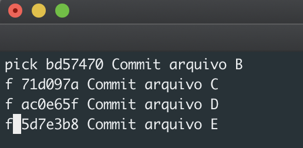

# Git Rebase

## Tutorial para *Squash*

*Squash* Possibilita mudança histórica de *Commits* e novo agrupamento.

## Liste os *Commits*

*Git log*

ou 

*git log --oneline* ( Lista os *Commits* em apenas 1 linha)

## Escolha até qual *Commit* quer alterar

*git rebase -i HEAD~4* 

*-i*- = Interativo

*HEAD* = referente ao *commit* atual

*~4* = Até qual *commit* quero modificar (o número 4 é apenas um exemplo)

## Escolha a opção de interação com seu *commit*

## Use *Squash* ou *Fixup*

*S, Squash*

Usa o commit combinando com o anterior;

*F, Fixup* 

Usa o commit combinando com o anterior mas descarta a mensagem de log;

### Substitua de Pick para *F* ou *S*

## Deixe uma nova mensagem no *Commit*

Substitua *pick* por *r* e edite mensagem no *commit*

# Salve sua alterações

 basta apertar a tecla *ESC* `e em seguida o comando *:w / :q* 

para confirmar suas alterações e sair do modo interativo

## Veja as suas alterações

*git log --oneline*
=======
